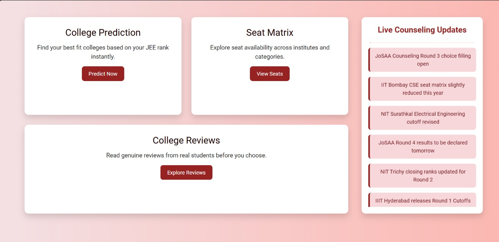
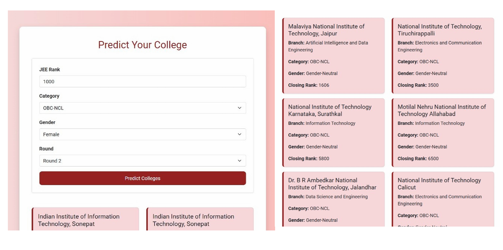

# 🎓 JEE College Predictor

A **full-stack web application** to help JEE aspirants predict eligible **NITs** based on **rank, category, and gender**.  
Built for speed, accuracy, and a responsive user experience.

---

## 🚀 Features
- **Rank-based prediction** — instantly find eligible colleges
- **Category & gender filters** — refine results easily
- **Seat matrix tracking** — updated seat availability
- **College reviews** — student-driven feedback
- **Responsive UI** — works seamlessly on desktop & mobile

---

## 🛠 Tech Stack
- **Frontend:** HTML, CSS, JavaScript
- **Backend:** Node.js, Express
- **Database:** MongoDB

---

## 📸 Outputs

### Dashboard


### Features Page


### Seat Matrix


### Prediction Results


---

## 📦 Installation

```bash
git clone https://github.com/Manvitha0704/jee-college-predictor.git
cd jee-college-predictor
npm install
```

---

## ⚙️ Configuration

1. Create a `.env` file in the project root directory.  
2. Add your environment variables, for example:

```env
PORT=3000
MONGODB_URI=mongodb://localhost:27017/jee-predictor
JWT_SECRET=your_jwt_secret_key
```

3. Replace the example values with your own:

- `PORT`: Port number to run the server (default is 3000).
- `MONGODB_URI`: Your MongoDB connection string (local or cloud).
- `JWT_SECRET`: A strong secret key for authentication (keep it private!).

4. Save the `.env` file.

---

## 🚀 Running the Application

1. Run the following command in the project root directory:

```bash
npm start
```

---

