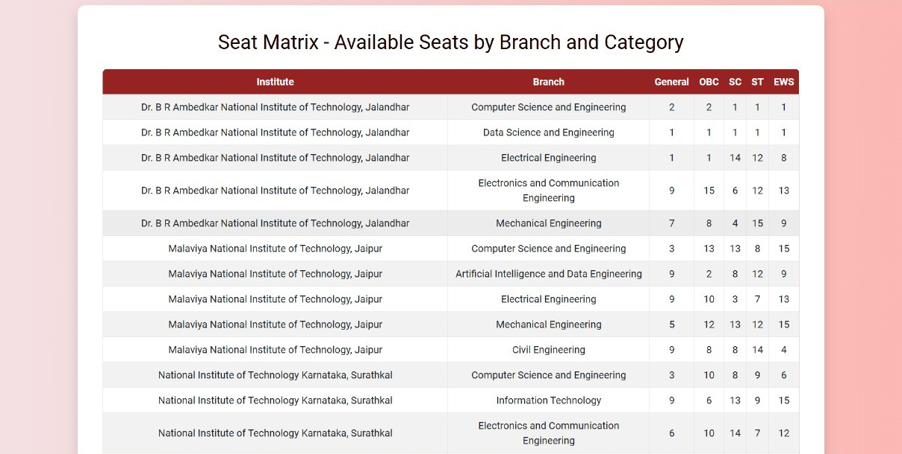

# 🎓 JEE College Predictor

A **full-stack web application** to help JEE aspirants predict eligible **NITs** based on **rank, category, and gender**.  
Built for speed, accuracy, and a responsive user experience.

---

## 🚀 Features
- **Rank-based prediction** — instantly find eligible colleges
- **Category & gender filters** — refine results easily
- **Seat matrix tracking** — updated seat availability
- **College reviews** — student-driven feedback
- **Responsive UI** — works seamlessly on desktop & mobile

---

## 🛠 Tech Stack
- **Frontend:** HTML, CSS, JavaScript
- **Backend:** Node.js, Express
- **Database:** MongoDB

---

## 📸 Screenshots

### Dashboard


### Features Page


### Seat Matrix


### Prediction Results


---

## 📦 Installation

```bash
git clone https://github.com/Manvitha0704/jee-college-predictor.git
cd jee-college-predictor
npm install
